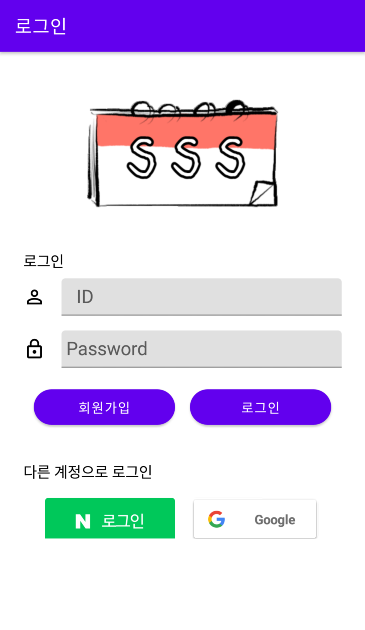

# SaeHoonSchedulingSystem



약속을 편하게 관리할 수 있는 안드로이드 어플리케이션 입니다.

## Getting Started / 어떻게 시작하나요?

SaeHoon's Scheduling System Api Server를 먼저 실행 후 Android Studio로 프로젝트를 열고 프로젝트를 빌드하여 실행하시면 됩니다.


### Prerequisites / 선행 조건

아래 사항들이 설치가 되어있어야합니다.

```
Android Studio 2020.3.1 이상, Android SDK Tools 23 이상, Android 5.0(Lollipop) 이상, SaeHoon's Scheduling System Api Server
```
+ [SaeHoon's Scheduling System Server](https://github.com/githubKudoi/sss-api-server)

## Built With / 누구랑 만들었나요?

* [금정욱](https://github.com/urarik) - 프로젝트 설계, 어플리케이션 프로트엔드 제작, 데이터 분석
* [박세훈](https://github.com/psh3253) - 프로젝트 설계, 어플리케이션 백엔드 제작
* [문빈](https://github.com/githubKudoi) - 프로젝트 설계, API 서버 제작
* [정수용](https://github.com/shion0202) - 프로젝트 설계, 어플리케이션 프로트엔드 제작
* [이소연](https://github.com/닉네임) - 프로젝트 설계, 데이터베이스 설계

## Function / 기능
+ 로그인
+ 회원가입
+ 친구 추가
+ 친구 차단 및 삭제
+ 약속 생성
+ 약속 초대 및 수락
+ 약속 목록 보기
+ 약속 상세 정보 보기
+ 그룹 생성
+ 그룹 초대 및 수락
+ 그룹 삭제
+ 그룹 목록 보기
+ 그룹 상세 정보 보기
+ 인기 약속 장소 추천

## Technology / 기술

+ Retrofit2를 사용한 웹 서버와 통신
+ Room을 사용한 내부 데이터 저장
+ NodeJS Express를 사용한 웹 API 서버
+ Scikit-learn를 사용한 인기 약속 장소 데이터 분석
+ Selenium을 사용한 장소 이미지 크롤링
+ Firebase와 Naver API를 사용한 소설 로그인

## License / 라이센스

이 프로젝트는 MIT 라이센스로 라이센스가 부여되어 있습니다. 자세한 내용은 LICENSE 파일을 참고하세요.
